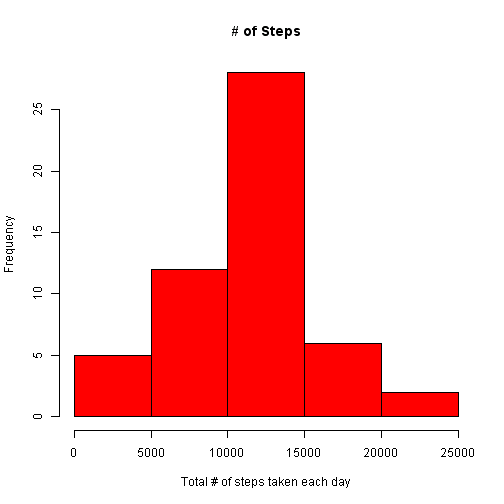
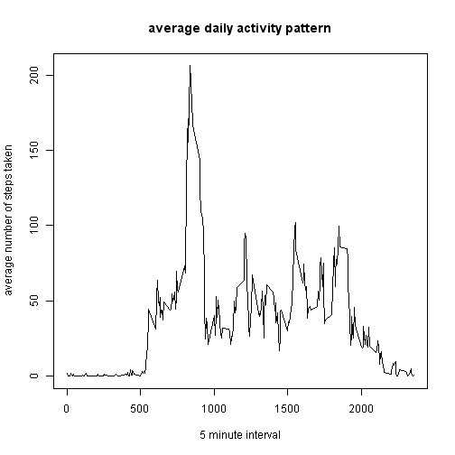
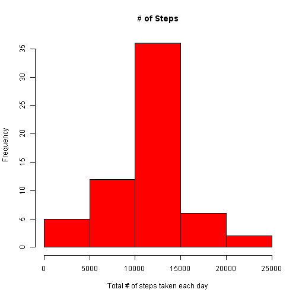

# Reproducible Research: Peer Assessment 1

```r
library(plyr)
library(lattice)
```

## Loading and preprocessing the data

```r
unzipf <- unzip("activity.zip")
df <- read.csv("activity.csv", header = TRUE)
```

### For this part of the assignment, you can ignore the missing values in the dataset.

```r
clean_df <- df[which(df$steps != "NA"), ]
```

## What is mean total number of steps taken per day?

```r
t_by_day <- ddply(clean_df, .(date), summarise, steps = sum(steps))
```

### Make a histogram of the total number of steps taken each day

```r
hist(t_by_day$steps, main = "# of Steps", xlab = "Total # of steps taken each day", 
    col = "red")
```

 

### Calculate and report the mean and median total number of steps taken per day

```r
mean(t_by_day$steps)
```

```
## [1] 10766
```

```r
median(t_by_day$steps)
```

```
## [1] 10765
```

## What is the average daily activity pattern?

```r
av_by_intv <- ddply(clean_df, .(interval), summarise, steps = mean(steps))
```

### Make a time series plot (i.e. type = "l") of the 5-minute interval (x-axis) and the average number of steps taken, averaged across all days (y-axis)

```r
plot(av_by_intv$interval, av_by_intv$steps, type = "l", col = "black", xlab = "5 minute interval", 
    ylab = "average number of steps taken", main = "average daily activity pattern")
```

 

### Which 5-minute interval, on average across all the days in the dataset, contains the maximum number of steps?

```r
colnames(av_by_intv)[2] <- "IntervalAvg"
```

## Imputing missing values

### Calculate and report the total number of missing values in the dataset (i.e. the total number of rows with NAs)

```r
sum(is.na(df$steps))
```

```
## [1] 2304
```

### Fill NA's with average for that 5-min interval

```r
merge <- arrange(join(df, av_by_intv), interval)
```

```
## Joining by: interval
```

### Create a new dataset that is equal to the original dataset but with the missing data filled in.

```r
merge$steps[is.na(merge$steps)] <- merge$IntervalAvg[is.na(merge$steps)]
```

# Make a histogram of the total number of steps taken each day

```r
new_t_by_day <- ddply(merge, .(date), summarise, steps = sum(steps))
hist(new_t_by_day$steps, main = "# of Steps", xlab = "Total # of steps taken each day", 
    col = "red", )
```

 

### Calculate and report the mean and median total number of steps taken per day.

```r
mean(new_t_by_day$steps)
```

```
## [1] 10766
```

```r
median(new_t_by_day$steps)
```

```
## [1] 10766
```

```r
t_steps1 <- sum(clean_df$steps)
t_steps2 <- sum(merge$steps)
```

### Do these values differ from the estimates from the first part of the assignment? What is the impact of imputing missing data on the estimates of the total daily number of steps?

```r
t_diff <- t_steps2 - t_steps1
```

Imputing added 8.613 &times; 10<sup>4</sup> steps.
No change in means since interval average was chosen for the imputation. Histogram and median changed.

## Are there differences in activity patterns between weekdays and weekends?
### Create a new factor variable in the dataset with two levels - "weekday" and "weekend" indicating whether a given date is a weekday or weekend day.

```r
Sys.setlocale("LC_TIME", "English")
```

```
## [1] "English_United States.1252"
```

```r
wd <- weekdays(as.Date(merge$date))
df_wd <- transform(merge, day = wd)
df_wd$wk <- ifelse(df_wd$day %in% c("Saturday", "Sunday"), "week end", "week day")
av_by_intv_wk <- ddply(df_wd, .(interval, wk), summarise, steps = mean(steps))
```

### Make a panel plot containing a time series plot (i.e. type = "l") of the 5-minute interval (x-axis) and the average number of steps taken, averaged across all weekday days or weekend days (y-axis). 

```r
xyplot(steps ~ interval | wk, data = av_by_intv_wk, layout = c(1, 2), type = "l")
```

 

